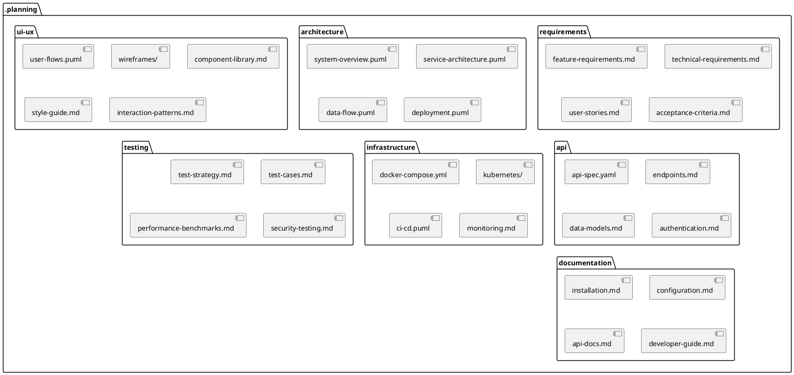

# Planning Directory Structure

## Directory Structure Overview

### /requirements
- Feature requirements and specifications
- Technical requirements
- User stories and scenarios
- Acceptance criteria

### /architecture
- System architecture diagrams
- Service interaction flows
- Data flow diagrams
- Deployment architecture

### /ui-ux
- User flow diagrams
- Wireframes and mockups
- Component library documentation
- Design system and style guide
- Interaction patterns

### /api
- API specifications (OpenAPI/Swagger)
- Endpoint documentation
- Data models
- Authentication and authorization

### /infrastructure
- Docker configurations
- Kubernetes manifests
- CI/CD pipeline diagrams
- Monitoring and observability

### /testing
- Testing strategy
- Test case specifications
- Performance testing plans
- Security testing requirements

### /documentation
- Installation guides
- Configuration documentation
- API documentation
- Developer guides 