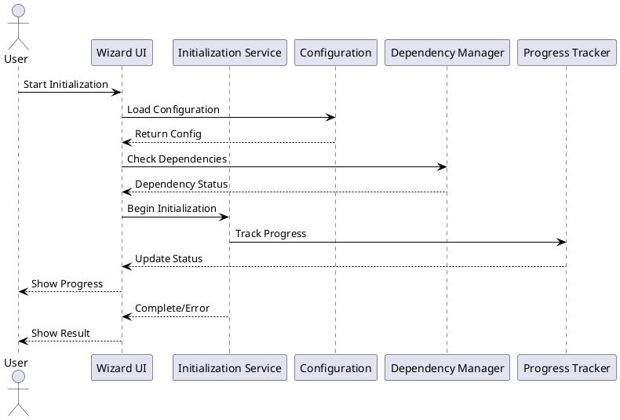
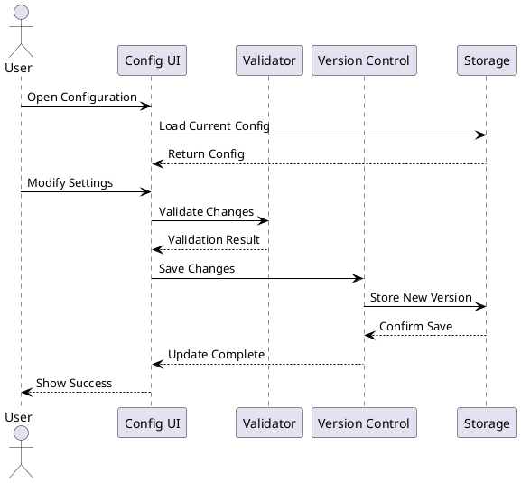
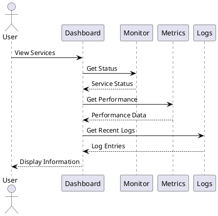
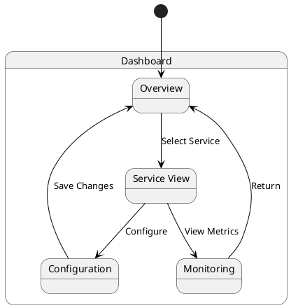
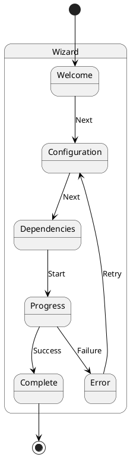

# Feature Analysis

## Core Features

### 1. System Initialization

#### Current Implementation
- Modular initialization system
- Configuration validation
- Dependency management
- Progress tracking
- Error handling

#### User Interaction Requirements


### 2. Configuration Management

#### Current Implementation
- Configuration validation
- Schema-based configuration
- Version control
- Import/Export functionality

#### User Interaction Requirements


### 3. Service Management

#### Current Implementation
- Service status monitoring
- Health checks
- Performance metrics
- Log aggregation

#### User Interaction Requirements


## UI/UX Requirements

### 1. Dashboard Layout

#### Components
- Service status cards
- Performance graphs
- Quick action buttons
- Alert notifications
- Navigation menu

#### Interaction Patterns


### 2. Initialization Wizard

#### Steps
1. Welcome & Overview
2. Configuration Review
3. Dependency Check
4. Initialization Progress
5. Completion/Error

#### Flow


## API Requirements

### 1. REST Endpoints

#### Initialization
```yaml
/initialization:
  post:
    summary: Start initialization
    responses:
      200:
        description: Initialization started
      400:
        description: Invalid configuration
      500:
        description: Server error

/initialization/status:
  get:
    summary: Get initialization status
    responses:
      200:
        description: Current status
      404:
        description: No initialization in progress
```

#### Configuration
```yaml
/config:
  get:
    summary: Get current configuration
  put:
    summary: Update configuration
  post:
    summary: Validate configuration

/config/history:
  get:
    summary: Get configuration history
  post:
    summary: Restore configuration version
```

### 2. WebSocket Events

#### Real-time Updates
```typescript
interface WebSocketEvents {
  'initialization.progress': {
    step: string;
    progress: number;
    status: 'running' | 'completed' | 'failed';
  };
  'service.status': {
    service: string;
    status: 'up' | 'down' | 'degraded';
    metrics: Record<string, number>;
  };
  'alert.triggered': {
    type: 'error' | 'warning' | 'info';
    message: string;
    timestamp: string;
  };
}
```

## Technical Implementation

### 1. Frontend Architecture

#### Vue 3 Components
```typescript
// Core Components
interface InitializationComponents {
  Wizard: Component;
  StatusCard: Component;
  ConfigEditor: Component;
  ServiceMonitor: Component;
  AlertSystem: Component;
}

// State Management
interface StoreModules {
  initialization: {
    status: Ref<InitializationStatus>;
    progress: Ref<number>;
    start: () => Promise<void>;
    stop: () => void;
  };
  configuration: {
    current: Ref<Config>;
    history: Ref<ConfigVersion[]>;
    save: (config: Config) => Promise<void>;
    restore: (version: string) => Promise<void>;
  };
  services: {
    list: Ref<Service[]>;
    status: Ref<Record<string, ServiceStatus>>;
    metrics: Ref<Record<string, ServiceMetrics>>;
  };
}
```

### 2. Backend Architecture

#### Laravel Services
```php
// Service Provider
class ModularInitializationServiceProvider extends ServiceProvider
{
    public function register(): void
    {
        $this->app->singleton(InitializationManager::class);
        $this->app->singleton(ConfigurationManager::class);
        $this->app->singleton(ServiceManager::class);
    }

    public function boot(): void
    {
        $this->loadRoutesFrom(__DIR__.'/../routes/api.php');
        $this->loadMigrationsFrom(__DIR__.'/../database/migrations');
        $this->publishes([
            __DIR__.'/../config' => config_path('modular-init'),
        ]);
    }
}
```

#### Python Services
```python
# FastAPI Service
class InitializationService:
    def __init__(self, config: Config):
        self.config = config
        self.websocket = WebSocketManager()
        self.queue = QueueManager()
    
    async def initialize(self, components: List[str]) -> None:
        task = await self.queue.enqueue(
            'initialization',
            {'components': components}
        )
        await self.websocket.broadcast(
            'initialization.started',
            {'task_id': task.id}
        )
```

## Infrastructure Requirements

### 1. Docker Setup
```yaml
version: '3.8'
services:
  app:
    build: 
      context: .
      dockerfile: docker/app.dockerfile
    environment:
      - APP_ENV=production
    volumes:
      - .:/var/www/html
    depends_on:
      - mysql
      - redis
      - rabbitmq

  python:
    build:
      context: ./python
      dockerfile: Dockerfile
    environment:
      - PYTHONUNBUFFERED=1
    depends_on:
      - rabbitmq
```

### 2. Kubernetes Configuration
```yaml
apiVersion: apps/v1
kind: Deployment
metadata:
  name: initialization-service
spec:
  replicas: 2
  template:
    spec:
      containers:
      - name: app
        image: initialization-app:latest
        ports:
        - containerPort: 80
        env:
        - name: APP_ENV
          value: production
```

## Testing Strategy

### 1. Frontend Testing
```typescript
// Component Tests
describe('InitializationWizard', () => {
  it('should guide user through initialization', async () => {
    const wrapper = mount(InitializationWizard);
    await wrapper.find('.next-button').trigger('click');
    expect(wrapper.find('.step-2').exists()).toBe(true);
  });
});

// Store Tests
describe('initializationStore', () => {
  it('should track initialization progress', async () => {
    const store = useInitializationStore();
    await store.start();
    expect(store.progress).toBeGreaterThan(0);
  });
});
```

### 2. Backend Testing
```php
// PHP Tests
class InitializationTest extends TestCase
{
    public function testInitializationProcess(): void
    {
        $manager = $this->app->make(InitializationManager::class);
        $result = $manager->initialize(['database', 'cache']);
        
        $this->assertTrue($result->isSuccessful());
        $this->assertDatabaseHas('initialization_status', [
            'status' => 'completed'
        ]);
    }
}
```

```python
# Python Tests
def test_initialization_service():
    service = InitializationService(test_config)
    result = await service.initialize(['database'])
    assert result.status == 'completed'
    assert result.progress == 100
``` 