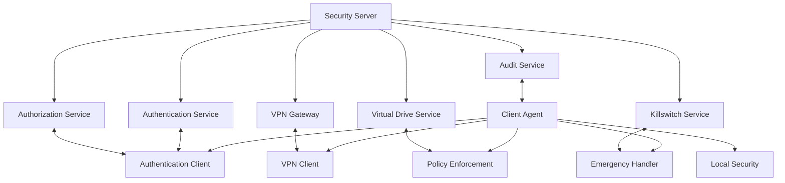
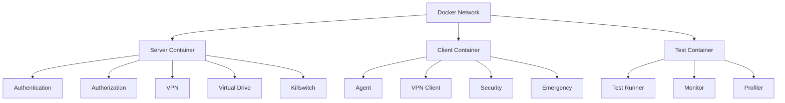

# Security System Architecture

## System Overview

### High-Level Architecture

## Component Specifications

### 1. Security Server

#### Authentication Service
- REST API for authentication
- JWT token management
- Session handling
- Emergency token validation
- Audit logging

#### Authorization Service
- Role-based access control
- Policy enforcement
- Permission management
- Access logging
- Policy updates

#### VPN Gateway
- OpenVPN integration
- Split tunneling configuration
- Traffic monitoring
- Bandwidth management
- Connection health checks

#### Virtual Drive Service
- Encrypted storage management
- Access control
- Drive provisioning
- Backup management
- Recovery procedures

#### Killswitch Service
- Hardware control interface
- Software control interface
- Emergency override handling
- Graceful shutdown
- Recovery procedures

#### Audit Service
- Event logging
- Security monitoring
- Performance metrics
- Alert generation
- Report generation

### 2. Client Agent

#### Authentication Client
- Token management
- Session handling
- Emergency override
- Local validation
- Secure storage

#### VPN Client
- Connection management
- Split tunneling
- Health monitoring
- Automatic reconnection
- Secure configuration

#### Policy Enforcement
- Local policy storage
- Policy validation
- Access control
- Resource management
- Update handling

#### Local Security
- System checks
- Security validation
- Resource monitoring
- Event logging
- Alert handling

#### Emergency Handler
- Killswitch control
- Emergency override
- Recovery procedures
- System protection
- Alert handling

## Communication Protocols

### Authentication Protocol
1. Client initiates authentication
2. Server validates credentials
3. Server issues JWT token
4. Client stores token securely
5. Token used for subsequent requests

### Authorization Protocol
1. Client requests access
2. Server validates token
3. Server checks permissions
4. Server grants/denies access
5. Client enforces locally

### VPN Protocol
1. Client authenticates
2. Server validates
3. VPN connection established
4. Traffic routed through VPN
5. Health checks performed

### Killswitch Protocol
1. Server issues kill command
2. Client receives command
3. Emergency check performed
4. System shutdown initiated
5. Recovery procedures followed

### Virtual Drive Protocol
1. Client requests access
2. Server validates
3. Drive provisioned
4. Access granted
5. Usage monitored

## Security Measures

### Authentication Security
- Multi-factor authentication
- Hardware token support
- Biometric authentication
- Emergency tokens
- Session management

### Communication Security
- TLS 1.3 encryption
- Certificate pinning
- Message signing
- Rate limiting
- IP filtering

### Storage Security
- Encrypted storage
- Secure key management
- Access control
- Audit logging
- Backup procedures

### System Security
- Secure boot
- TPM integration
- Hardware encryption
- Process isolation
- Resource protection

## Testing Architecture

### Docker Environment

### Test Components
- Server emulation
- Client emulation
- Network simulation
- Security testing
- Performance testing

### Monitoring Components
- Connection monitoring
- Security event logging
- Performance metrics
- Resource utilization
- Alert system

## Implementation Details

### Server Implementation
- Node.js/TypeScript
- Express.js
- PostgreSQL
- Redis
- Docker

### Client Implementation
- C++/Rust
- Windows API
- TPM integration
- Hardware control
- System integration

### Testing Implementation
- Python
- Docker
- TestNG
- JMeter
- Prometheus

## Deployment Architecture

### Server Deployment
- Docker containers
- Kubernetes orchestration
- Load balancing
- High availability
- Disaster recovery

### Client Deployment
- Windows installer
- Silent installation
- Automatic updates
- Configuration management
- Recovery procedures

### Monitoring Deployment
- Prometheus
- Grafana
- ELK Stack
- AlertManager
- Custom dashboards

## Security Considerations

### Network Security
- Firewall configuration
- VPN security
- Traffic encryption
- Access control
- Monitoring

### System Security
- Secure boot
- TPM usage
- Encryption
- Access control
- Monitoring

### Application Security
- Code signing
- Process isolation
- Memory protection
- Input validation
- Error handling

### Data Security
- Encryption
- Access control
- Backup procedures
- Audit logging
- Recovery procedures 