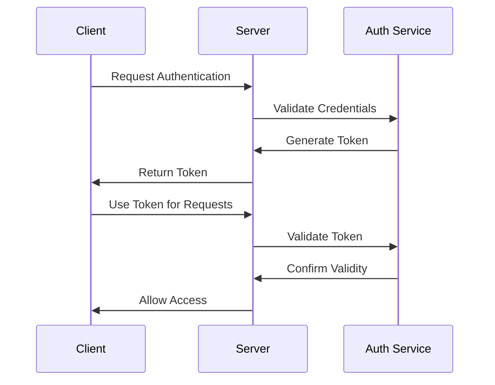
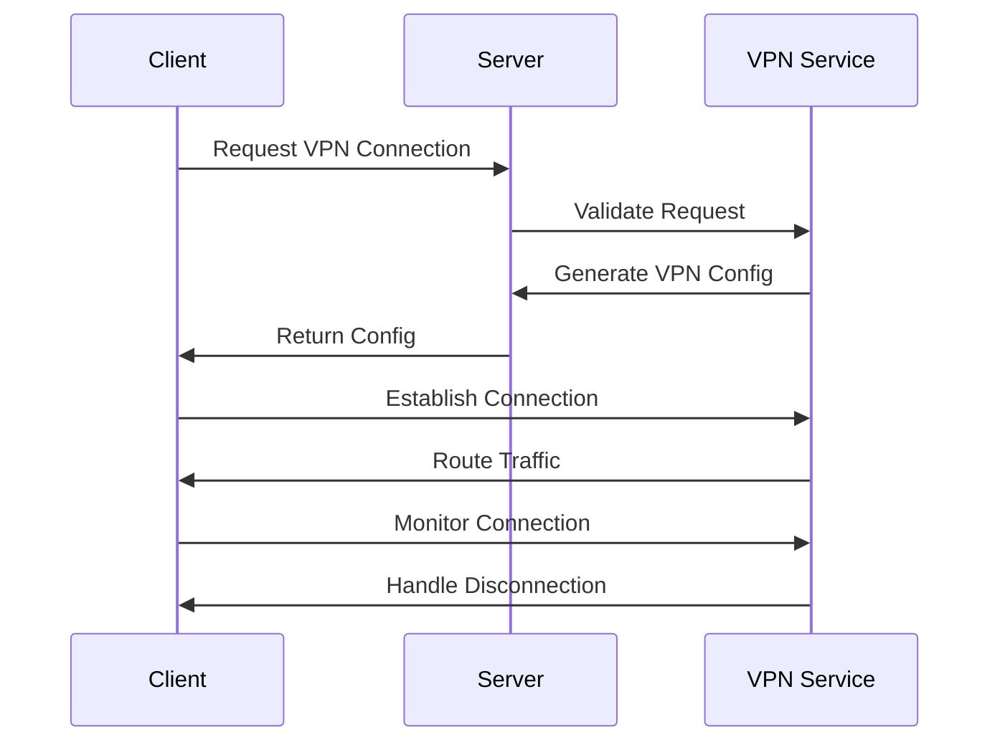
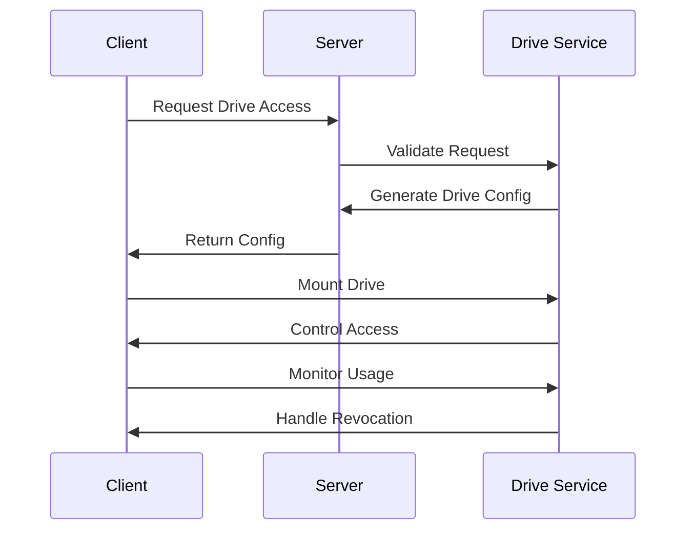
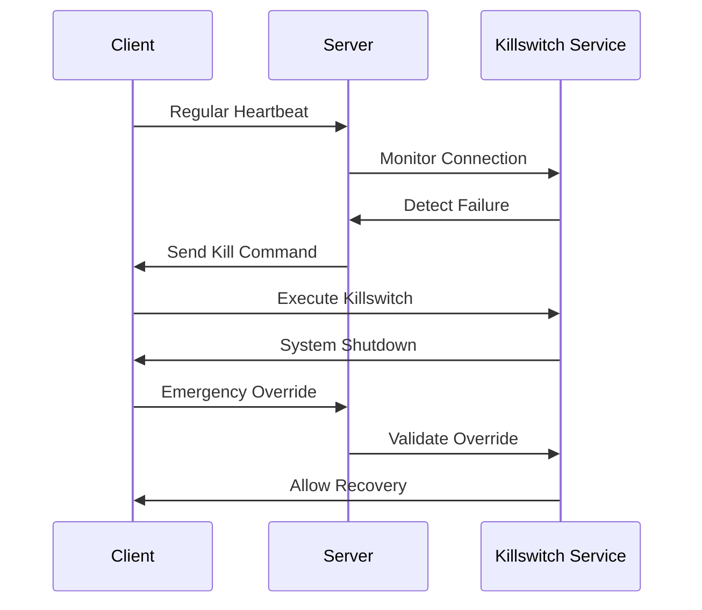

# Client-Server Architecture and Protocols

## System Overview

### Components

```mermaid
graph TD
    A[Security Server] --> B[Authentication Service]
    A --> C[Authorization Service]
    A --> D[VPN Service]
    A --> E[Drive Management Service]
    A --> F[Killswitch Service]
    
    G[Client Agent] --> H[Security Agent]
    G --> I[VPN Client]
    G --> J[Policy Enforcer]
    G --> K[Local Security]
    
    B --> L[User Authentication]
    B --> M[Token Management]
    B --> N[Session Control]
    
    C --> O[Access Control]
    C --> P[Policy Enforcement]
    C --> Q[Audit Logging]
    
    D --> R[Traffic Routing]
    D --> S[Connection Management]
    D --> T[Performance Monitoring]
    
    E --> U[Drive Provisioning]
    E --> V[Access Control]
    E --> W[Usage Monitoring]
    
    F --> X[System Control]
    F --> Y[Emergency Override]
    F --> Z[Recovery Procedures]
```


## Communication Protocols

### 1. Authentication Protocol


### 2. VPN Protocol


### 3. Virtual Drive Protocol


### 4. Killswitch Protocol


## Security Measures

### 1. Communication Security
```typescript
class SecureCommunication {
  async encryptData(): Promise<void> {
    // Use TLS 1.3
    // Implement perfect forward secrecy
    // Enforce strong ciphers
    // Validate certificates
  }

  async authenticateChannel(): Promise<void> {
    // Verify server identity
    // Validate client credentials
    // Manage session tokens
    // Handle renegotiation
  }

  async monitorTraffic(): Promise<void> {
    // Detect anomalies
    // Log suspicious activity
    // Block malicious traffic
    // Alert administrators
  }
}
```

### 2. Authentication Security
```typescript
class AuthenticationSecurity {
  async validateCredentials(): Promise<void> {
    // Check password strength
    // Verify multi-factor auth
    // Validate biometrics
    // Handle rate limiting
  }

  async manageTokens(): Promise<void> {
    // Generate secure tokens
    // Implement token rotation
    // Handle revocation
    // Monitor usage
  }

  async controlSessions(): Promise<void> {
    // Manage session timeouts
    // Handle concurrent sessions
    // Detect anomalies
    // Enforce policies
  }
}
```

### 3. Data Security
```typescript
class DataSecurity {
  async encryptData(): Promise<void> {
    // Use AES-256
    // Implement E2E encryption
    // Manage keys securely
    // Handle key rotation
  }

  async controlAccess(): Promise<void> {
    // Enforce permissions
    // Monitor usage
    // Detect violations
    // Handle revocation
  }

  async backupData(): Promise<void> {
    // Create secure backups
    // Verify integrity
    // Test recovery
    // Monitor storage
  }
}
```

## Implementation Details

### 1. Server API
```typescript
interface SecurityServer {
  // Authentication
  login(username: string, password: string): Promise<AuthToken>
  logout(token: AuthToken): Promise<void>
  refreshToken(token: AuthToken): Promise<AuthToken>
  
  // VPN Control
  connectVPN(token: AuthToken): Promise<VPNConfig>
  disconnectVPN(token: AuthToken): Promise<void>
  monitorVPN(token: AuthToken): Promise<VPNMetrics>
  
  // Drive Management
  provisionDrive(token: AuthToken): Promise<DriveConfig>
  revokeDrive(token: AuthToken): Promise<void>
  monitorDrive(token: AuthToken): Promise<DriveMetrics>
  
  // System Control
  activateKillswitch(token: AuthToken): Promise<void>
  deactivateKillswitch(token: AuthToken): Promise<void>
  monitorSystem(token: AuthToken): Promise<SystemMetrics>
}
```

### 2. Client Agent
```typescript
class SecurityAgent {
  async enforceSecurity(): Promise<void> {
    // Monitor system state
    // Enforce policies
    // Handle violations
    // Report status
  }

  async manageVPN(): Promise<void> {
    // Establish connection
    // Route traffic
    // Monitor performance
    // Handle disconnection
  }

  async controlDrives(): Promise<void> {
    // Mount drives
    // Control access
    // Monitor usage
    // Handle revocation
  }

  async handleKillswitch(): Promise<void> {
    // Monitor connection
    // Execute shutdown
    // Handle override
    // Manage recovery
  }
}
```

### 3. Local Security
```typescript
class LocalSecurity {
  async enforcePolicies(): Promise<void> {
    // Check system state
    // Validate integrity
    // Monitor activity
    // Handle violations
  }

  async monitorSystem(): Promise<void> {
    // Track performance
    // Monitor resources
    // Detect anomalies
    // Report issues
  }

  async handleEmergency(): Promise<void> {
    // Process alerts
    // Execute actions
    // Log events
    // Notify server
  }
}
```

## Testing Strategy

### 1. Unit Testing
```typescript
describe('Security Server', () => {
  it('should handle authentication')
  it('should manage VPN connections')
  it('should control virtual drives')
  it('should handle killswitch')
  it('should enforce security policies')
})

describe('Client Agent', () => {
  it('should enforce local security')
  it('should manage VPN client')
  it('should control virtual drives')
  it('should handle killswitch')
  it('should report status')
})
```

### 2. Integration Testing
```typescript
describe('Client-Server Integration', () => {
  it('should maintain secure communication')
  it('should handle authentication flow')
  it('should manage VPN connections')
  it('should control virtual drives')
  it('should handle killswitch')
})
```

### 3. Security Testing
```typescript
describe('Security Testing', () => {
  it('should prevent unauthorized access')
  it('should protect sensitive data')
  it('should detect tampering')
  it('should handle emergencies')
  it('should maintain audit logs')
})
```

## Monitoring and Profiling

### 1. Real-time Monitoring
```typescript
class SecurityMonitor {
  async monitorConnections(): Promise<void> {
    // Track VPN connections
    // Monitor authentication
    // Log security events
    // Profile system performance
  }

  async trackAuthentication(): Promise<void> {
    // Monitor login attempts
    // Track token usage
    // Detect anomalies
    // Handle violations
  }

  async auditAccess(): Promise<void> {
    // Log file access
    // Track system changes
    // Monitor policy enforcement
    // Record security events
  }
}
```

### 2. Performance Profiling
```typescript
class PerformanceProfiler {
  async profileSystem(): Promise<void> {
    // Monitor CPU usage
    // Track memory usage
    // Measure disk I/O
    // Analyze network traffic
  }

  async profileApplication(): Promise<void> {
    // Track API performance
    // Monitor response times
    // Measure throughput
    // Analyze error rates
  }

  async profileSecurity(): Promise<void> {
    // Monitor encryption
    // Track authentication
    // Measure authorization
    // Analyze audit logging
  }
}
```

## Recovery Procedures

### 1. System Recovery
```typescript
class SystemRecovery {
  async initiateRecovery(): Promise<void> {
    // Validate system state
    // Check integrity
    // Restore configuration
    // Verify security
  }

  async validateSystem(): Promise<void> {
    // Check components
    // Verify policies
    // Test functionality
    // Monitor performance
  }

  async restoreAccess(): Promise<void> {
    // Validate credentials
    // Restore permissions
    // Verify security
    // Monitor activity
  }
}
```

### 2. Data Recovery
```typescript
class DataRecovery {
  async backupData(): Promise<void> {
    // Create secure backups
    // Verify integrity
    // Store securely
    // Monitor storage
  }

  async restoreData(): Promise<void> {
    // Validate backup
    // Restore files
    // Verify integrity
    // Monitor access
  }

  async verifyRecovery(): Promise<void> {
    // Check data integrity
    // Verify permissions
    // Monitor usage
    // Log activity
  }
}
```

## Documentation

### 1. Technical Documentation
- Architecture overview
- API documentation
- Security protocols
- Testing procedures
- Recovery procedures

### 2. User Documentation
- Installation guide
- Configuration manual
- Usage instructions
- Troubleshooting guide
- Emergency procedures

### 3. Security Documentation
- Security policies
- Access control procedures
- Audit procedures
- Incident response
- Recovery procedures 