# MCP Server Architecture

## System Overview

### Components

```mermaid
graph TD
    A[MCP Server] --> B[Security Control]
    A --> C[Agent Management]
    A --> D[Development Tools]
    A --> E[Monitoring Hub]
    A --> F[Testing Framework]
    
    B --> G[Security Server]
    C --> H[Client Agents]
    D --> I[Development Environment]
    E --> J[Monitoring System]
    F --> K[Testing Infrastructure]
    
    G --> L[Authentication]
    G --> M[Authorization]
    G --> N[VPN Control]
    G --> O[Drive Management]
    G --> P[Killswitch]
    
    H --> Q[Security Agent]
    H --> R[VPN Client]
    H --> S[Policy Enforcer]
    H --> T[Local Security]
    
    I --> U[Code Editor]
    I --> V[Debug Tools]
    I --> W[Version Control]
    I --> X[CI/CD Pipeline]
    
    J --> Y[Real-time Monitoring]
    J --> Z[Performance Profiling]
    J --> AA[Security Auditing]
    J --> AB[Alert System]
    
    K --> AC[Unit Testing]
    K --> AD[Integration Testing]
    K --> AE[Security Testing]
    K --> AF[Performance Testing]
```


## Core Features

### 1. Security Control
```typescript
class SecurityControl {
  async manageAuthentication(): Promise<void> {
    // Handle user authentication
    // Manage tokens
    // Control access
    // Enforce policies
  }

  async controlVPN(): Promise<void> {
    // Manage VPN connections
    // Route traffic
    // Monitor usage
    // Enforce rules
  }

  async manageDrives(): Promise<void> {
    // Provision virtual drives
    // Control access
    // Monitor usage
    // Handle revocation
  }

  async handleKillswitch(): Promise<void> {
    // Control system access
    // Manage emergency overrides
    // Handle recovery
    // Log events
  }
}
```

### 2. Agent Management
```typescript
class AgentManager {
  async deployAgents(): Promise<void> {
    // Install agents
    // Configure settings
    // Initialize security
    // Start services
  }

  async monitorAgents(): Promise<void> {
    // Track status
    // Monitor health
    // Check compliance
    // Handle issues
  }

  async updateAgents(): Promise<void> {
    // Push updates
    // Verify integrity
    // Apply patches
    // Rollback if needed
  }

  async controlAgents(): Promise<void> {
    // Send commands
    // Enforce policies
    // Manage access
    // Handle emergencies
  }
}
```

### 3. Development Tools
```typescript
class DevelopmentTools {
  async setupEnvironment(): Promise<void> {
    // Configure Docker
    // Setup networks
    // Initialize services
    // Prepare testing
  }

  async manageCode(): Promise<void> {
    // Handle version control
    // Manage branches
    // Review code
    // Deploy changes
  }

  async runTests(): Promise<void> {
    // Execute unit tests
    // Run integration tests
    // Perform security tests
    // Generate reports
  }

  async monitorDevelopment(): Promise<void> {
    // Track progress
    // Monitor performance
    // Check quality
    // Generate metrics
  }
}
```

### 4. Monitoring Hub
```typescript
class MonitoringHub {
  async trackMetrics(): Promise<void> {
    // Monitor system metrics
    // Track performance
    // Analyze usage
    // Generate reports
  }

  async handleAlerts(): Promise<void> {
    // Process alerts
    // Notify users
    // Escalate issues
    // Track resolution
  }

  async auditSecurity(): Promise<void> {
    // Check compliance
    // Monitor threats
    // Track violations
    // Generate reports
  }

  async profilePerformance(): Promise<void> {
    // Analyze performance
    // Identify bottlenecks
    // Optimize systems
    // Generate insights
  }
}
```

### 5. Testing Framework
```typescript
class TestingFramework {
  async setupTesting(): Promise<void> {
    // Configure Docker
    // Initialize services
    // Prepare data
    // Setup monitoring
  }

  async runTests(): Promise<void> {
    // Execute test suites
    // Monitor results
    // Track coverage
    // Generate reports
  }

  async validateSecurity(): Promise<void> {
    // Check compliance
    // Test vulnerabilities
    // Verify encryption
    // Audit access
  }

  async profilePerformance(): Promise<void> {
    // Load test
    // Stress test
    // Monitor metrics
    // Analyze results
  }
}
```

## Integration Points

### 1. Security Server Integration
```typescript
interface SecurityIntegration {
  // Authentication
  authenticateUser(): Promise<AuthToken>
  validateToken(): Promise<boolean>
  refreshToken(): Promise<AuthToken>
  
  // VPN Control
  connectVPN(): Promise<void>
  disconnectVPN(): Promise<void>
  monitorVPN(): Promise<VPNMetrics>
  
  // Drive Management
  provisionDrive(): Promise<DriveConfig>
  revokeDrive(): Promise<void>
  monitorDrive(): Promise<DriveMetrics>
  
  // System Control
  activateKillswitch(): Promise<void>
  deactivateKillswitch(): Promise<void>
  monitorSystem(): Promise<SystemMetrics>
}
```

### 2. Client Agent Integration
```typescript
interface AgentIntegration {
  // Agent Control
  startAgent(): Promise<void>
  stopAgent(): Promise<void>
  updateAgent(): Promise<void>
  monitorAgent(): Promise<AgentMetrics>
  
  // Security Enforcement
  enforcePolicy(): Promise<void>
  validateSystem(): Promise<boolean>
  handleEmergency(): Promise<void>
  monitorSecurity(): Promise<SecurityMetrics>
  
  // Development Support
  setupEnvironment(): Promise<void>
  runTests(): Promise<TestResults>
  monitorDevelopment(): Promise<DevMetrics>
  handleUpdates(): Promise<void>
}
```

## Testing Strategy

### 1. Unit Testing
```typescript
describe('MCP Server', () => {
  it('should manage security controls')
  it('should handle agent management')
  it('should support development tools')
  it('should provide monitoring capabilities')
  it('should facilitate testing')
})
```

### 2. Integration Testing
```typescript
describe('MCP Integration', () => {
  it('should integrate with security server')
  it('should manage client agents')
  it('should support development workflow')
  it('should provide monitoring services')
  it('should facilitate testing environment')
})
```

### 3. Security Testing
```typescript
describe('MCP Security', () => {
  it('should enforce security policies')
  it('should protect sensitive data')
  it('should control system access')
  it('should monitor security events')
  it('should handle emergencies')
})
```

## Deployment Strategy

### 1. Docker Setup
```yaml
version: '3.8'
services:
  mcp-server:
    image: mcp-server:latest
    environment:
      - SECURITY_SERVER_URL=http://security-server:8080
      - MONITORING_ENABLED=true
      - TESTING_ENABLED=true
    volumes:
      - ./config:/app/config
      - ./data:/app/data
    networks:
      - security-network
    ports:
      - "8080:8080"
      - "9090:9090"

  security-server:
    image: security-server:latest
    environment:
      - MCP_SERVER_URL=http://mcp-server:8080
      - VPN_ENABLED=true
      - DRIVE_MANAGEMENT_ENABLED=true
    volumes:
      - ./security:/app/security
      - ./vpn:/app/vpn
    networks:
      - security-network
    ports:
      - "8081:8081"

  client-agent:
    image: client-agent:latest
    environment:
      - MCP_SERVER_URL=http://mcp-server:8080
      - SECURITY_SERVER_URL=http://security-server:8081
    volumes:
      - ./agent:/app/agent
      - ./config:/app/config
    networks:
      - security-network

networks:
  security-network:
    driver: bridge
```

### 2. Monitoring Setup
```yaml
version: '3.8'
services:
  prometheus:
    image: prom/prometheus:latest
    volumes:
      - ./prometheus:/etc/prometheus
    networks:
      - monitoring-network
    ports:
      - "9090:9090"

  grafana:
    image: grafana/grafana:latest
    environment:
      - GF_SECURITY_ADMIN_PASSWORD=admin
    volumes:
      - ./grafana:/var/lib/grafana
    networks:
      - monitoring-network
    ports:
      - "3000:3000"

  node-exporter:
    image: prom/node-exporter:latest
    networks:
      - monitoring-network
    ports:
      - "9100:9100"

networks:
  monitoring-network:
    driver: bridge
```

## Documentation

### 1. Technical Documentation
- Architecture overview
- API documentation
- Integration guides
- Security protocols
- Testing procedures

### 2. User Documentation
- Installation guide
- Configuration manual
- Usage instructions
- Troubleshooting guide
- Emergency procedures

### 3. Security Documentation
- Security policies
- Access control procedures
- Audit procedures
- Incident response
- Recovery procedures 