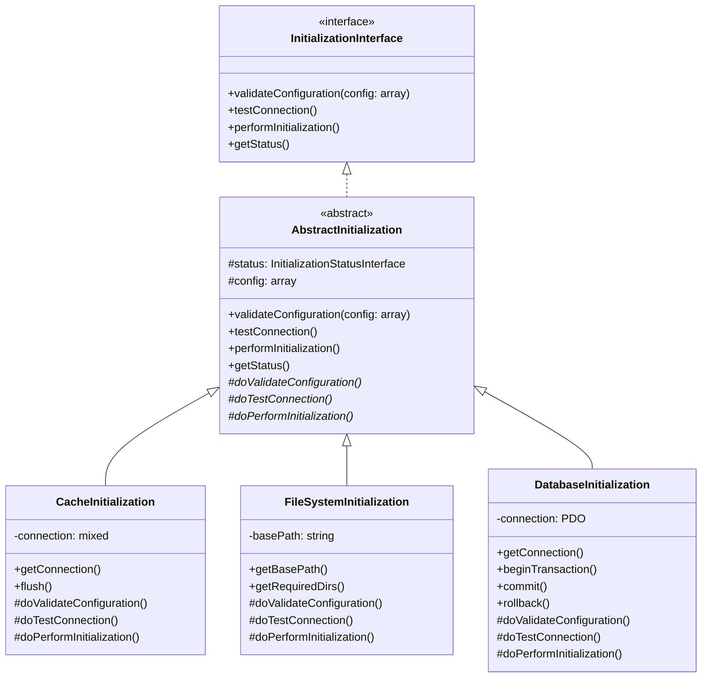
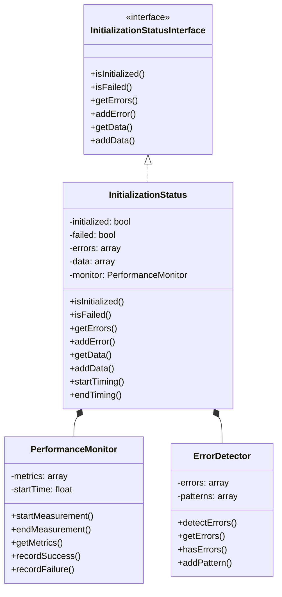
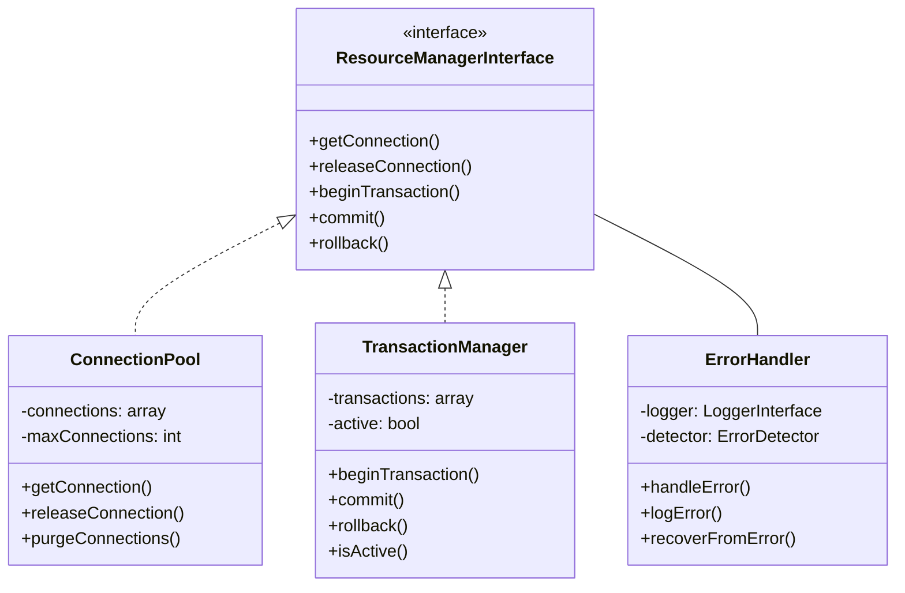
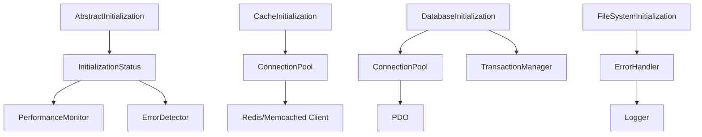
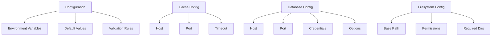
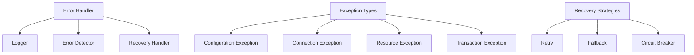
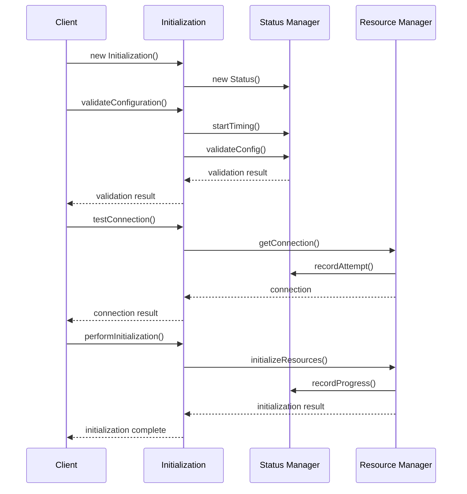
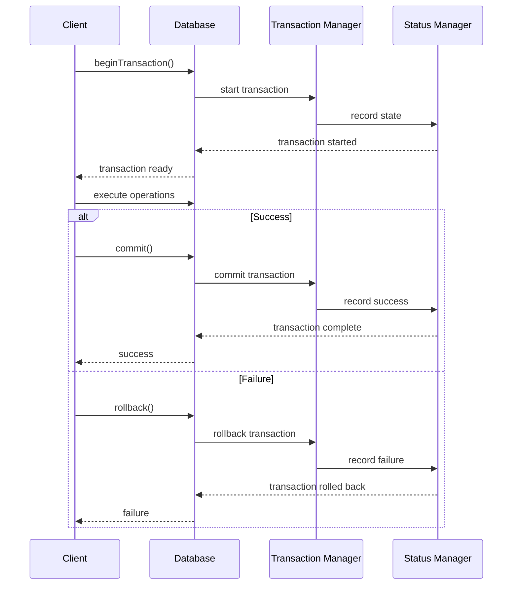
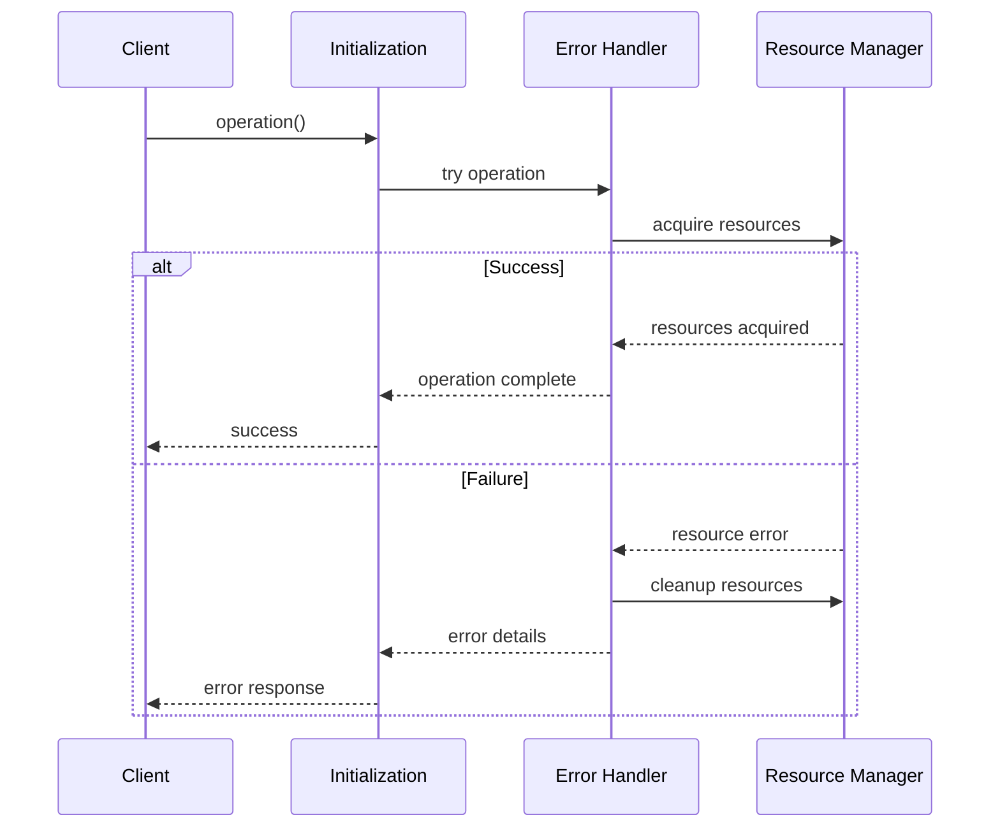

# Class Relationships

## Core Classes

### Initialization Framework

### Status Management

### Resource Management

## Dependencies

### Service Dependencies

### Configuration Dependencies

### Error Handling Dependencies

## Interaction Patterns

### Initialization Pattern

### Transaction Pattern

### Error Handling Pattern

