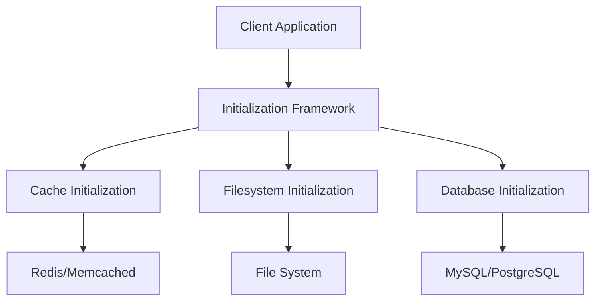
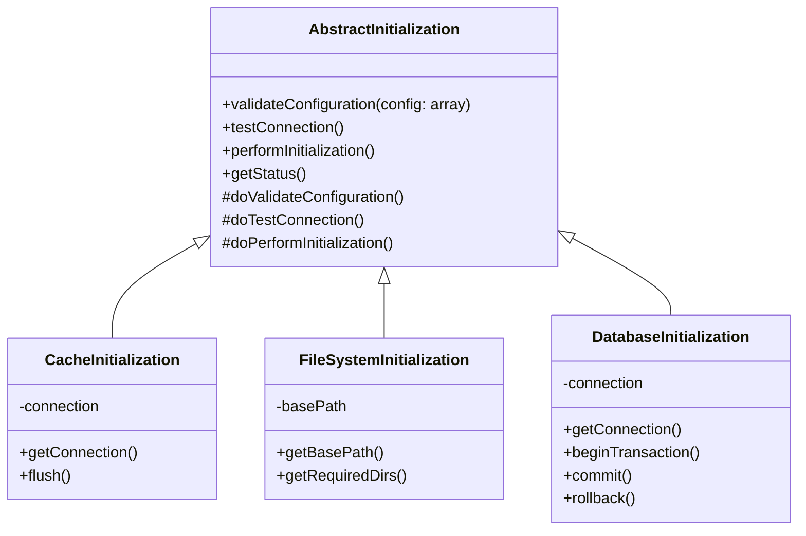
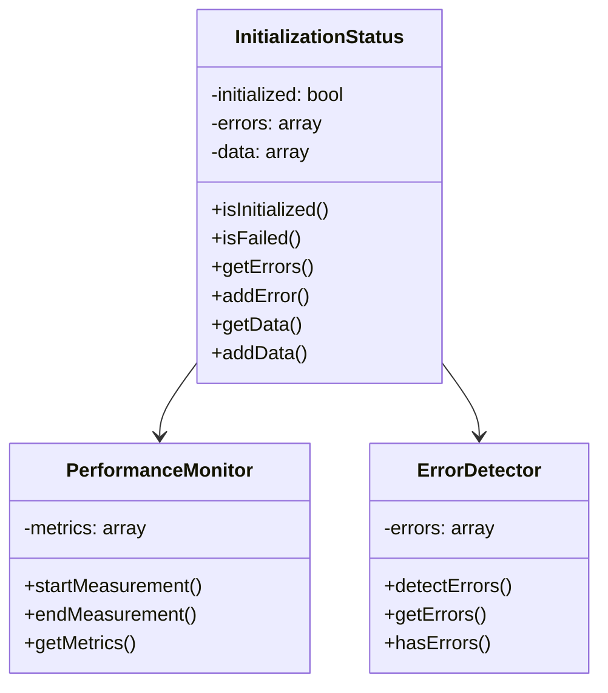
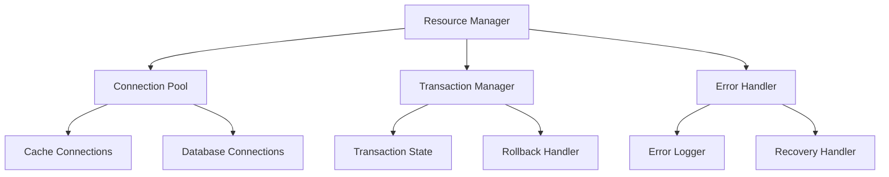
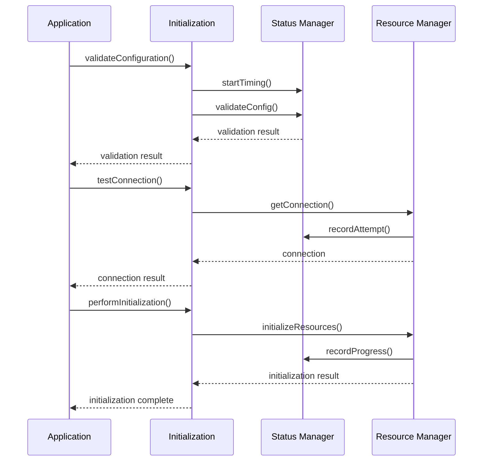
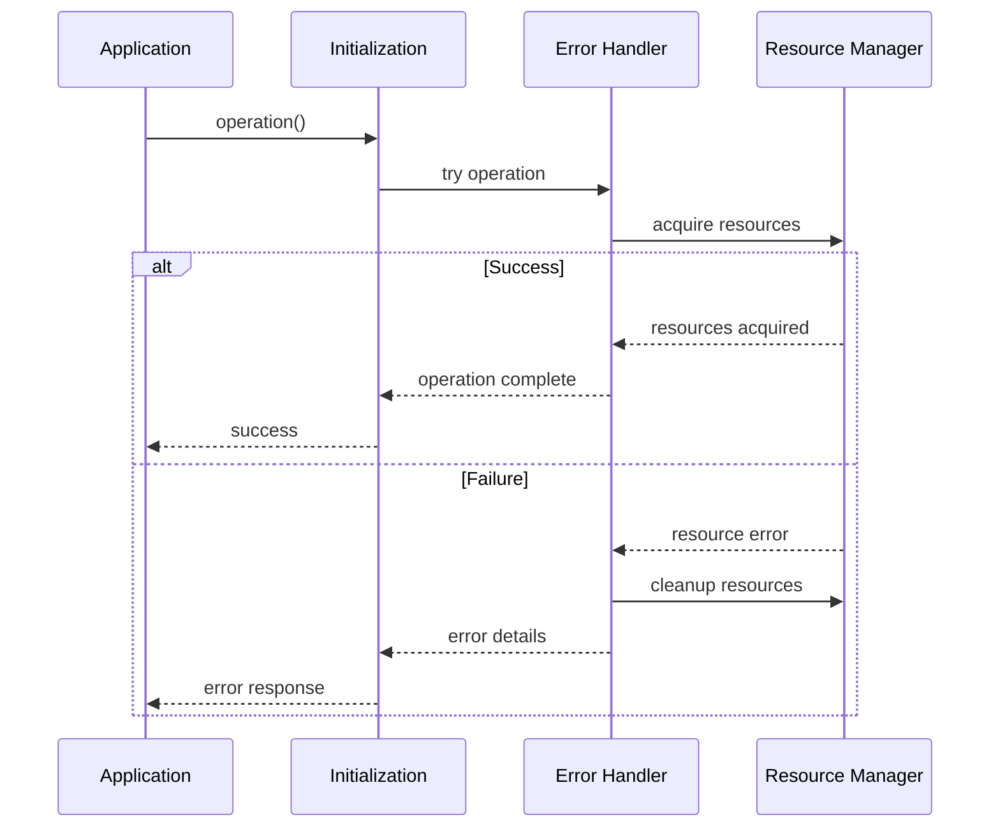
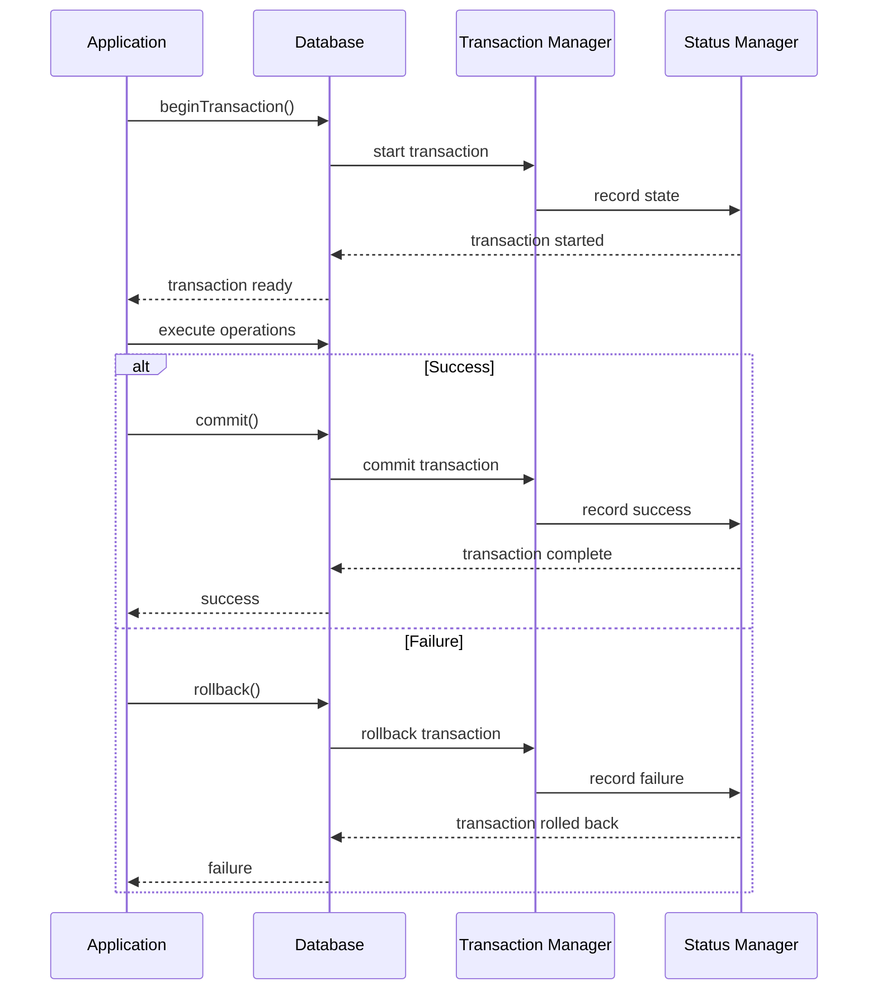
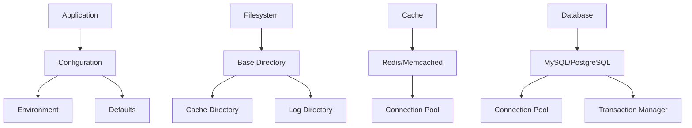
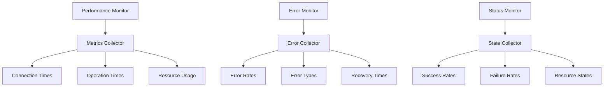
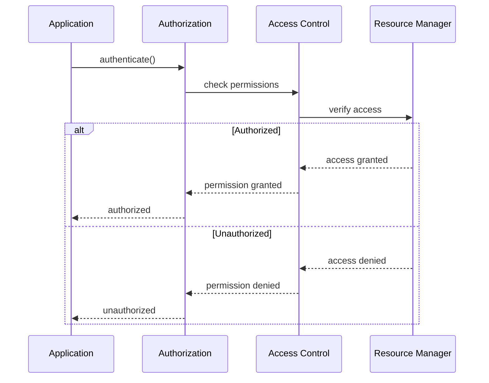

# Component Diagrams

## System Overview

## Framework Components

### Initialization Framework

### Status Management

### Resource Management

## Component Interactions

### Initialization Flow

### Error Handling

### Transaction Flow

## Resource Dependencies

## Performance Monitoring

## Security Flow

