# Data Flow

## Configuration Flow

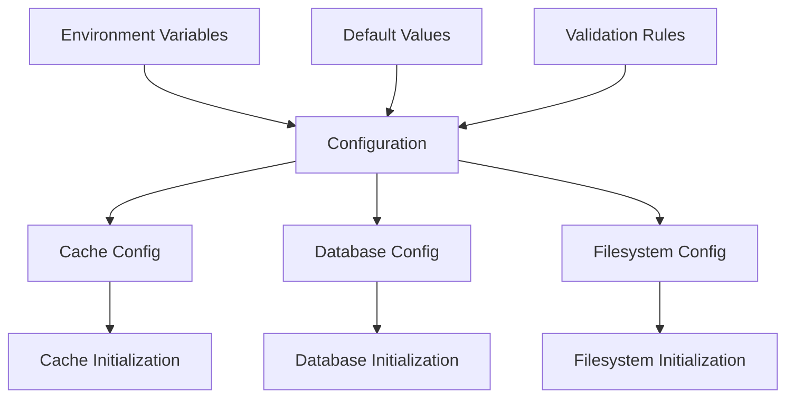

## Initialization Flow

### Cache Initialization

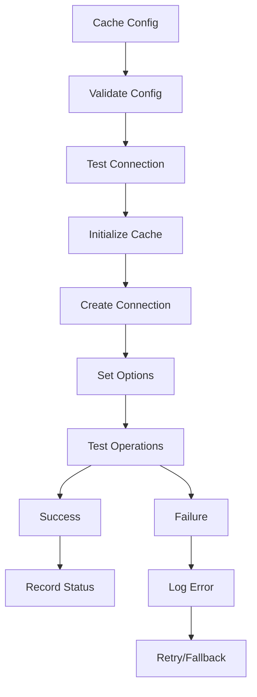

### Database Initialization

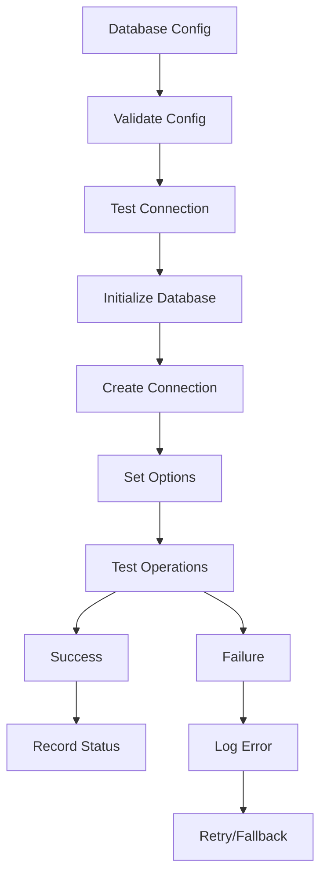

### Filesystem Initialization

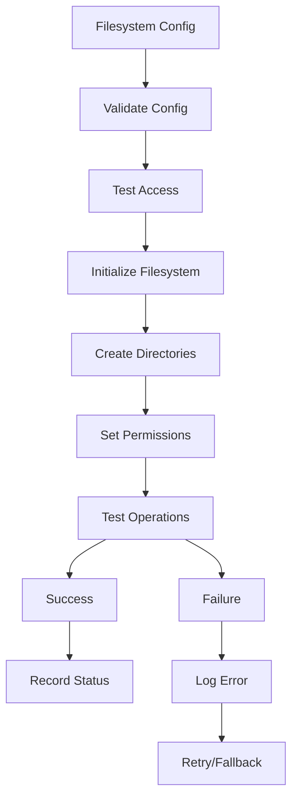

## Data Operations

### Cache Operations

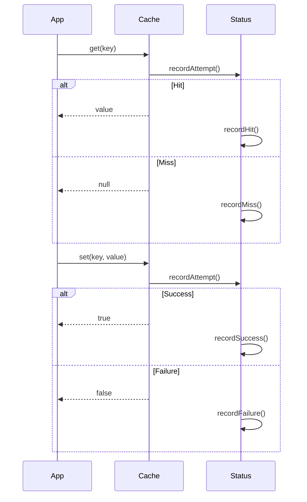

### Database Operations

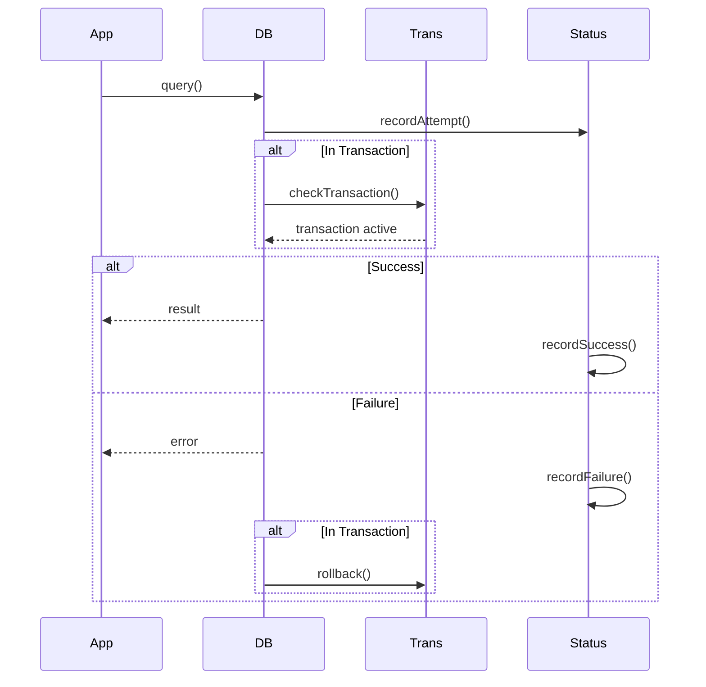

### Filesystem Operations

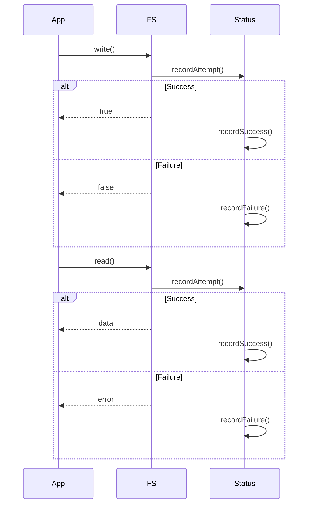

## Error Flow

### Error Detection

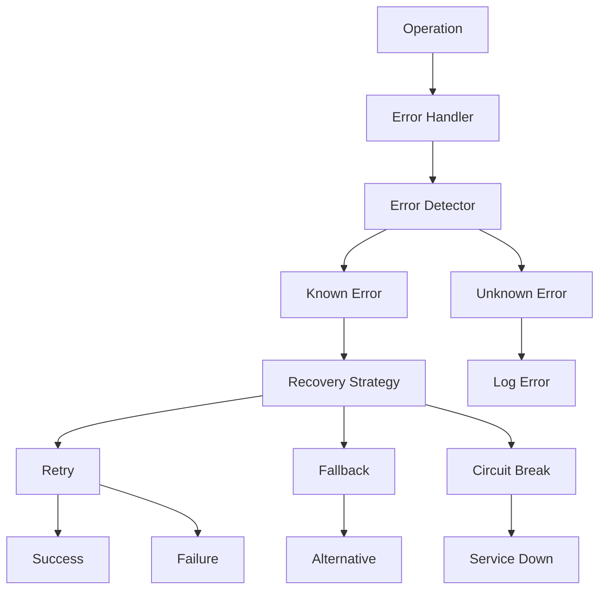

### Error Recovery

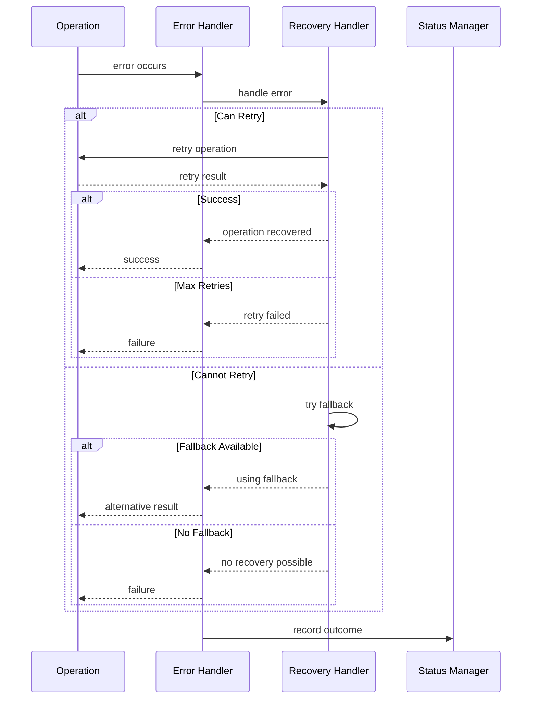

## Status Flow

### Status Tracking

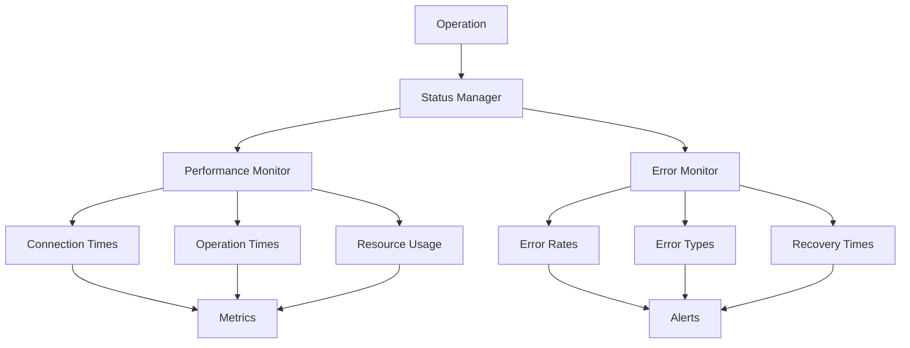

### Metric Collection

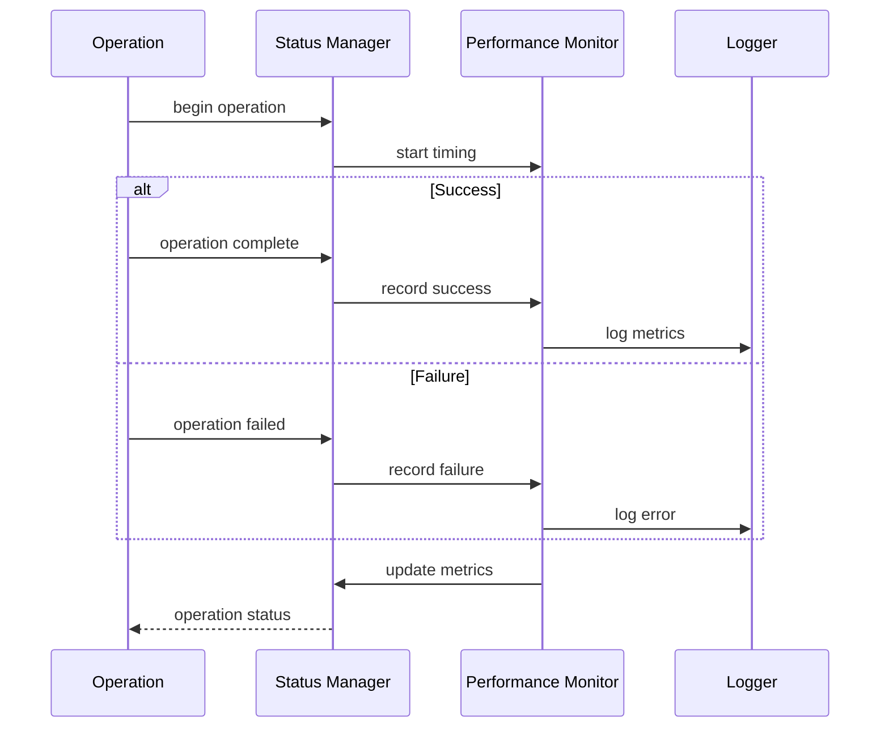