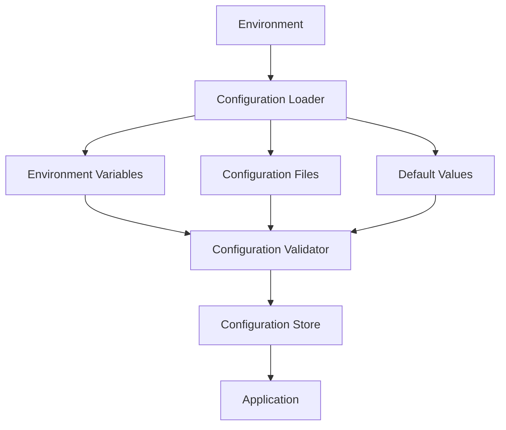
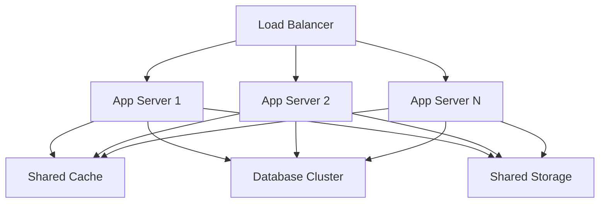
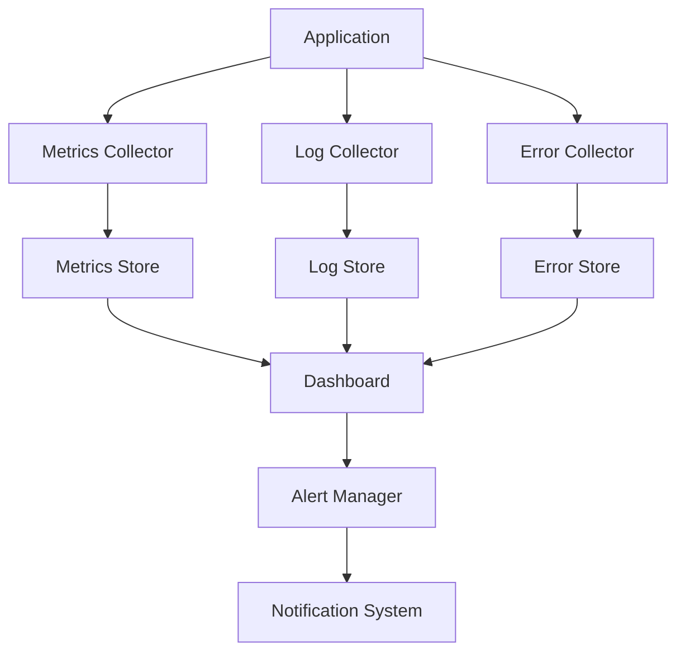

# Deployment Architecture

## Environment Requirements

### System Requirements

```yaml
system:
  php:
    version: ">=8.1"
    extensions:
      - pdo
      - pdo_mysql
      - redis
      - json
      - mbstring
      - openssl
  os:
    - linux
    - windows
    - macos
  memory:
    minimum: "512M"
    recommended: "1G"
  storage:
    minimum: "100M"
    recommended: "1G"
```

### Dependencies

```yaml
dependencies:
  cache:
    - redis: ">=6.0"
    - memcached: ">=1.6"
  database:
    - mysql: ">=8.0"
    - postgresql: ">=13"
  filesystem:
    - permissions: "755"
    - space: ">=1G"
```

## Configuration Management

### Environment Configuration

```yaml
environment:
  development:
    debug: true
    error_reporting: E_ALL
    cache:
      driver: redis
      host: localhost
      port: 6379
    database:
      driver: mysql
      host: localhost
      port: 3306
  staging:
    debug: false
    error_reporting: E_ALL & ~E_DEPRECATED
    cache:
      driver: redis
      host: staging-redis
      port: 6379
    database:
      driver: mysql
      host: staging-db
      port: 3306
  production:
    debug: false
    error_reporting: E_ALL & ~E_DEPRECATED & ~E_NOTICE
    cache:
      driver: redis
      host: production-redis
      port: 6379
    database:
      driver: mysql
      host: production-db
      port: 3306
```

### Configuration Flow



## Scaling Considerations

### Horizontal Scaling



### Resource Scaling

```yaml
scaling:
  cache:
    sharding: true
    replication: true
    failover: true
  database:
    read_replicas: 3
    write_master: 1
    failover: true
  filesystem:
    distributed: true
    replication: true
    backup: true
```

### Performance Scaling

```yaml
performance:
  cache:
    max_connections: 1000
    max_memory: "2G"
    eviction_policy: "allkeys-lru"
  database:
    max_connections: 500
    query_cache: "256M"
    buffer_pool: "1G"
  filesystem:
    max_connections: 1000
    cache_size: "1G"
    io_threads: 8
```

## Monitoring Setup

### Monitoring Architecture



### Monitoring Configuration

```yaml
monitoring:
  metrics:
    interval: 60
    retention: "30d"
    aggregation: "1h"
  logging:
    level: "info"
    retention: "7d"
    rotation: "daily"
  alerts:
    thresholds:
      cpu: 80
      memory: 85
      disk: 90
    channels:
      - email
      - slack
      - pagerduty
```

### Health Checks

```yaml
health_checks:
  cache:
    interval: 30
    timeout: 5
    retries: 3
  database:
    interval: 30
    timeout: 10
    retries: 3
  filesystem:
    interval: 60
    timeout: 15
    retries: 3
```

### Backup Strategy

```yaml
backup:
  database:
    schedule: "0 0 * * *"
    retention: "30d"
    compression: true
  filesystem:
    schedule: "0 2 * * *"
    retention: "7d"
    compression: true
  configuration:
    schedule: "0 1 * * *"
    retention: "90d"
    encryption: true
``` 