# Integration Architecture

## Framework Interactions

### Component Integration

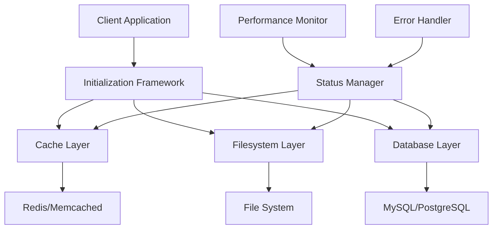

### Resource Management

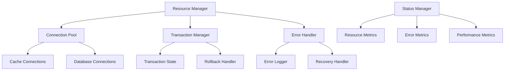

### Error Handling Strategy

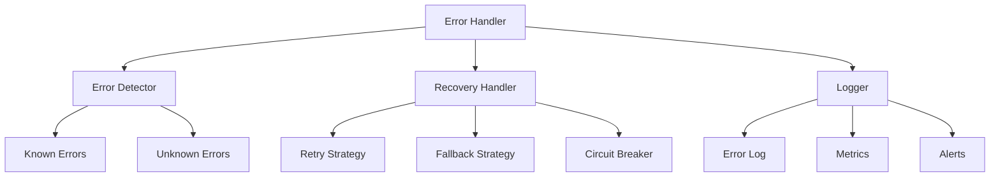

### Performance Optimization

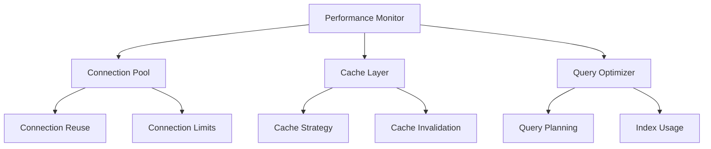

## Integration Patterns

### Service Integration

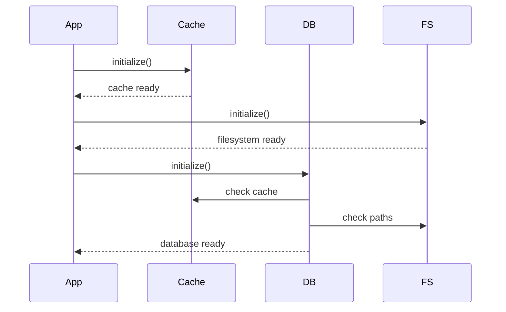

### Resource Coordination

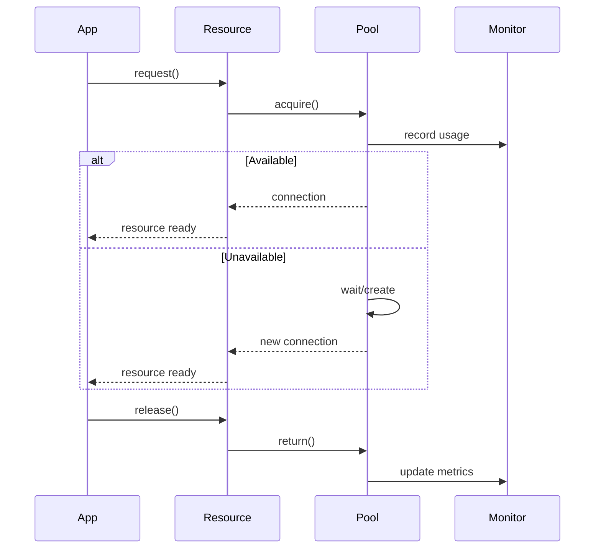

### Error Recovery

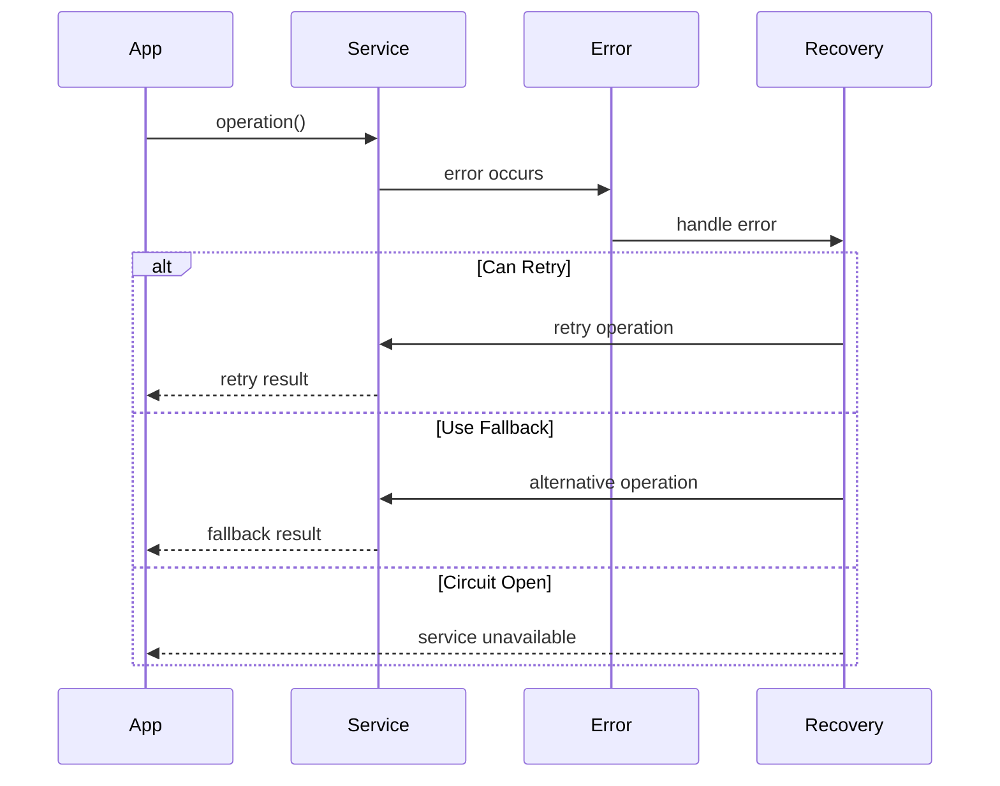

## Integration Components

### Connection Management

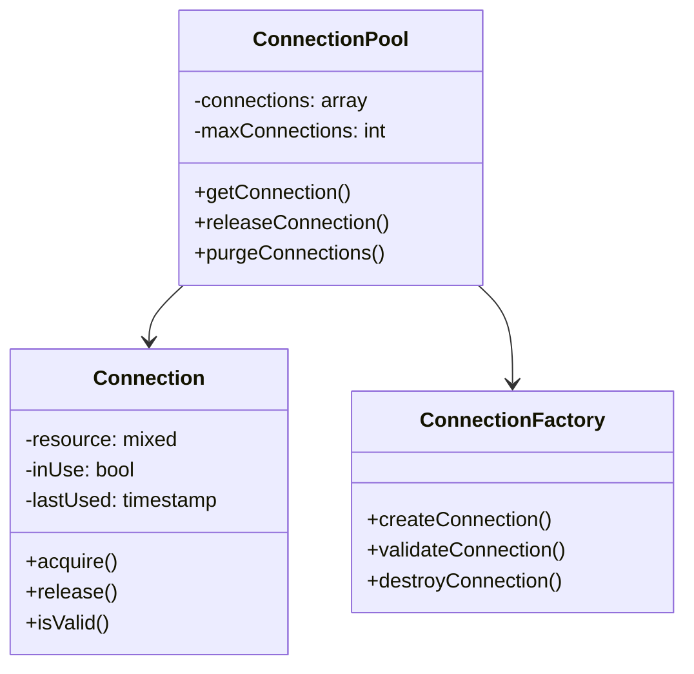

### Transaction Management

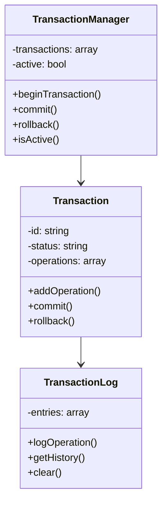

### Resource Monitoring

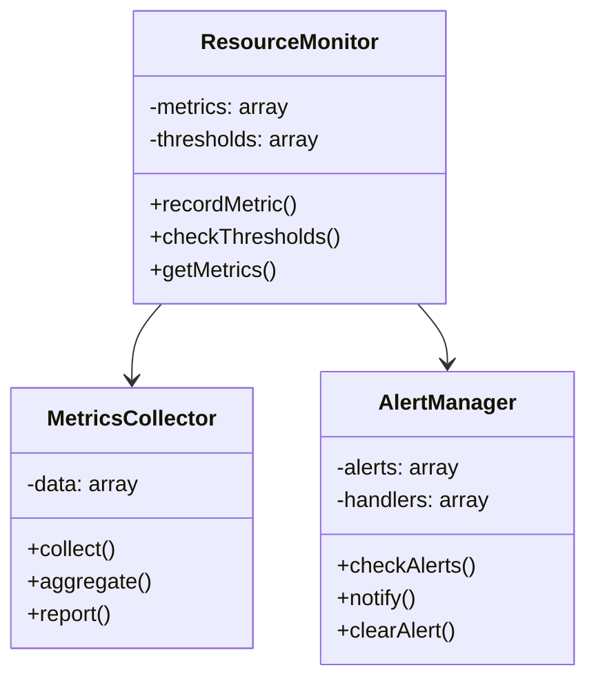

## Integration Configuration

### Service Configuration

```yaml
cache:
  driver: redis
  host: localhost
  port: 6379
  timeout: 5
  retry_attempts: 3
  retry_delay: 1.0

database:
  driver: mysql
  host: localhost
  port: 3306
  database: app_db
  username: app_user
  password: secret
  timeout: 5
  retry_attempts: 3
  retry_delay: 1.0

filesystem:
  base_path: /var/www/app
  permissions: 0755
  required_dirs:
    - cache
    - logs
    - uploads
```

### Resource Configuration

```yaml
connection_pool:
  max_connections: 10
  idle_timeout: 300
  max_lifetime: 3600
  validation_interval: 60

transaction:
  isolation_level: REPEATABLE_READ
  timeout: 30
  retry_attempts: 3
  deadlock_retry: true

monitoring:
  metrics_interval: 60
  alert_threshold: 0.9
  error_threshold: 0.1
  performance_threshold: 1.0
```

### Error Configuration

```yaml
error_handling:
  retry:
    max_attempts: 3
    delay: 1.0
    backoff: exponential
    
  circuit_breaker:
    threshold: 0.5
    window: 60
    reset_timeout: 300
    
  fallback:
    enabled: true
    strategies:
      - cache
      - local
      - default
```

## Integration Security

### Access Control

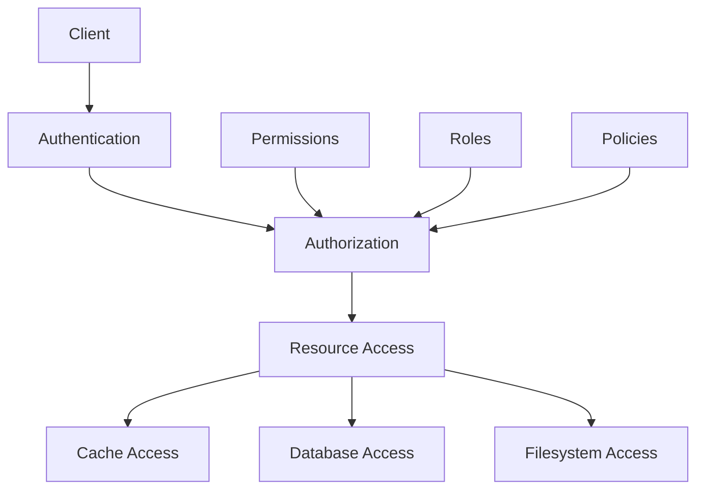

### Security Flow

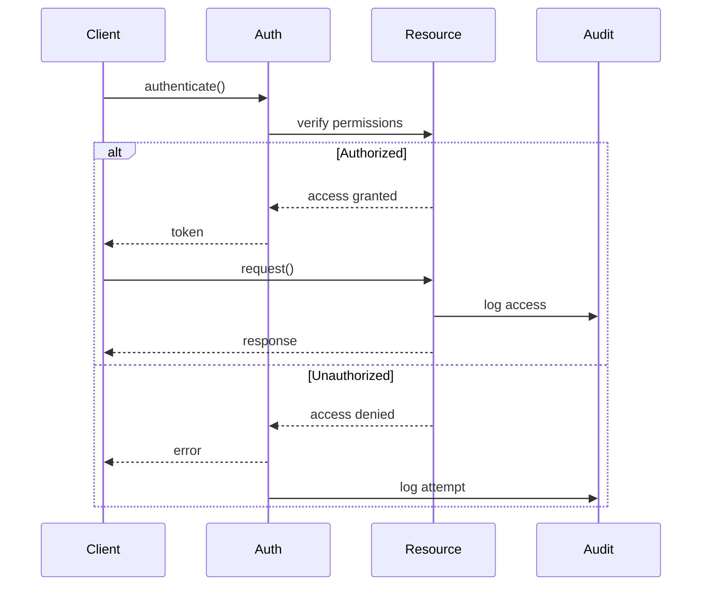