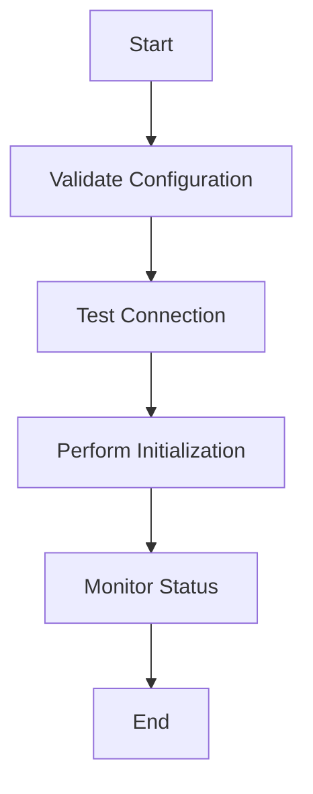
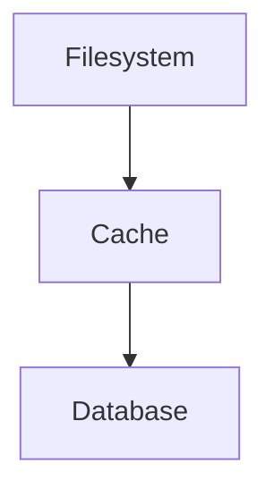

# Integration Patterns

## Overview
This document describes the integration patterns used in the initialization framework. The framework consists of three main components:
- Cache Initialization
- Filesystem Initialization
- Database Initialization

## Framework Interactions

### 1. Initialization Flow
Each initialization component follows a standard flow:
1. Configuration validation
2. Connection testing
3. Initialization
4. Status monitoring



### 2. Cross-Framework Communication
Components communicate through:
- Shared status objects
- Common error handling
- Performance monitoring
- Resource management

### 3. Resource Management
Resources are managed in the following order:
1. Filesystem initialization (base directories)
2. Cache initialization (for temporary storage)
3. Database initialization (for persistent storage)

## Error Handling

### 1. Error Propagation
Errors are propagated through:
- Status objects
- Exception handling
- Error logging
- Performance monitoring

### 2. Recovery Strategies
The framework implements several recovery strategies:
- Automatic retries
- Timeout handling
- Transaction rollback
- Resource cleanup

### 3. Error Types
Common error scenarios:
- Configuration errors
- Connection failures
- Permission issues
- Resource conflicts
- Timeout errors

## Performance Considerations

### 1. Resource Initialization
Resources are initialized in order of dependency:


### 2. Performance Monitoring
The framework monitors:
- Connection times
- Operation latency
- Resource usage
- Error rates
- Transaction performance

### 3. Optimization Strategies
Performance is optimized through:
- Connection pooling
- Resource caching
- Lazy initialization
- Parallel operations
- Transaction batching

## Security Considerations

### 1. Configuration Security
- Sensitive data handling
- Environment variables
- Configuration validation
- Access control

### 2. Resource Security
- File permissions
- Cache access
- Database credentials
- Connection security

### 3. Operation Security
- Transaction isolation
- Error message sanitization
- Resource cleanup
- Access logging

## Best Practices

### 1. Configuration
- Use environment variables
- Validate all inputs
- Set reasonable defaults
- Document all options

### 2. Error Handling
- Log all errors
- Provide clear messages
- Implement retries
- Clean up resources

### 3. Performance
- Monitor operations
- Set timeouts
- Use transactions
- Optimize resources

### 4. Security
- Validate inputs
- Sanitize outputs
- Control access
- Monitor operations

## Example Usage

### 1. Basic Initialization
```php
// Initialize filesystem
$fsInit = new FileSystemInitialization();
$fsInit->validateConfiguration($fsConfig);
$fsInit->performInitialization();

// Initialize cache
$cacheInit = new CacheInitialization();
$cacheInit->validateConfiguration($cacheConfig);
$cacheInit->performInitialization();

// Initialize database
$dbInit = new DatabaseInitialization();
$dbInit->validateConfiguration($dbConfig);
$dbInit->performInitialization();
```

### 2. Error Handling
```php
try {
    $dbInit->validateConfiguration($config);
    $dbInit->performInitialization();
} catch (\RuntimeException $e) {
    // Log error
    error_log($e->getMessage());
    
    // Get detailed status
    $status = $dbInit->getStatus();
    foreach ($status->getErrors() as $error) {
        error_log($error);
    }
    
    // Clean up resources
    if ($status->isInitialized()) {
        $dbInit->getConnection()->rollBack();
    }
}
```

### 3. Transaction Support
```php
// Begin transaction
$dbInit->beginTransaction();

try {
    // Perform operations
    $connection = $dbInit->getConnection();
    $connection->exec('CREATE TABLE test (id INT)');
    
    // Commit on success
    $dbInit->commit();
} catch (\Exception $e) {
    // Rollback on error
    $dbInit->rollback();
    throw $e;
}
```

### 4. Performance Monitoring
```php
// Get performance metrics
$status = $dbInit->getStatus();
$metrics = $status->getData('performance');

// Log metrics
error_log(sprintf(
    'Connection time: %0.2fs, Operations: %d, Errors: %d',
    $metrics['connection_time'],
    $metrics['operations'],
    $metrics['errors']
));
``` 